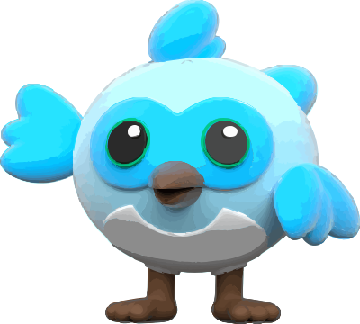
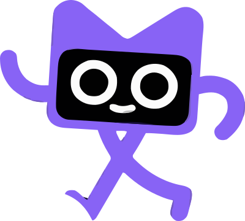

<div>
<h6>Chapter 0001</h6>
<hr style="height:2px;border-width:0;color:#606D7E;background-color:#606D7E">
</div>
</br>
</br>
</br>

<div>
    <h1 border-bottom='1px' >Hello World!!</h1>
</div>

<p>
Hello World!! is likely the most famous program and you can programming the following way.
</p>

<div>
    
    
</div>
<br>

```dart
void main() {
  print('Hello, world!!!');
}
```
<table bgcolor="#5CC6F7"><tr><td> <a color='#ffffff' href="https://dartpad.dev/">
  <font color="black"><i>&#9654;</i> Run </font>
</a></td></tr><table>

```
Hello, world!!!
```

<div>
    
        
</div>

<br>

```kt
fun main() {
    print("Hello, world!!!")
}
```
<table bgcolor="#7B5FCD"><tr><td> <a color='#ffffff' href="https://play.kotlinlang.org/#eyJ2ZXJzaW9uIjoiMi4wLjAiLCJwbGF0Zm9ybSI6ImphdmEiLCJhcmdzIjoiIiwibm9uZU1hcmtlcnMiOnRydWUsInRoZW1lIjoiaWRlYSIsImNvZGUiOiJmdW4gbWFpbigpIHtcbiAgICBwcmludChcIkhlbGxvLCB3b3JsZCEhIVwiKVxufSJ9">
  <font color="white"><i>&#9654;</i> Run </font>
</a></td></tr><table>

```
Hello, world!!!
```


